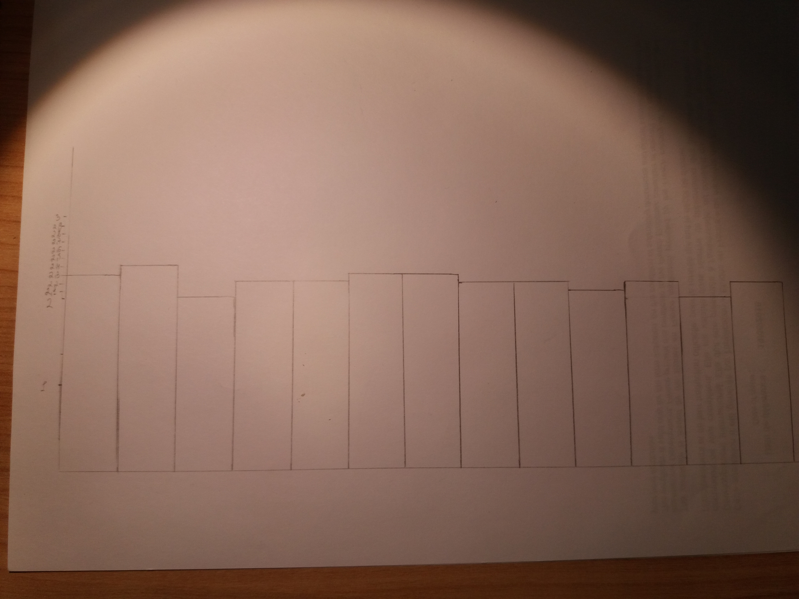

---
title: "Assignment 1"
author: "Natalia Kalashnikova"
date: "01 10 2017"
output: html_document

## Exercise 1

Git saves all information about data changes.
I dont see the difference between R and RStudio.

## Exercise 2

```{r}
possible_outcomes <- c(0, 1, 2, 3, 4, 5)
outcome_probabilities <- c(0.1, 0.5, 0.2, 0.1, 0.05, 0.05)
n_data_points <- 400
fake_data_points <- sample (possible_outcomes, n_data_points, replace=T, prob=outcome_probabilities) 
set.seed(NULL)

fake_data_set <- tibble::data_frame(`Fake measurement`=fake_data_points)
```
```{r}
ggplot2::ggplot(fake_data_set, ggplot2::aes(x=`Fake measurement`)) + ggplot2::geom_histogram(bins=5, colour="black", fill="lightgrey")
```
vue que sur laxe horizontale je vois les significations de possible_outcomes je suppose que ca signifie la liste des résultats possibles
outcome_probabilities - Wikipedia dit que outcomes peuvent se rencontrer probabilities qui sont entre 0 et 1 
n_data_points peut signifier laxe y - la limite jusqu'a laquelle on peut avoir les resultats
set.seed est une fonction qui sert à créer des simulations des objets aléatoires quon peut reproduire (selon les recherches sur Internet)


## Exercise 3

```{r}
iris_groups23 <- dplyr::filter(iris, Species %in% c("versicolor", "virginica"))
ggplot2::ggplot(iris_groups23, ggplot2::aes(x=Sepal.Width)) +
  ggplot2::geom_histogram(colour="black", fill="lightgrey", binwidth=0.1) +
  ggplot2::facet_grid(Species ~ .)
```
```{r}
library(magrittr)
iris_versicolor_subset <- dplyr::filter(iris,
                                        Sepal.Width <= 2.5,
                                        Species == "versicolor") %>%
                          dplyr::select(Sepal.Width, Species)
knitr::kable(iris_versicolor_subset)
```
```{r}

```
```{r}
iris_groups23 <- dplyr::filter(iris, Species %in% c("versicolor", "virginica"))
ggplot2::ggplot(iris_groups23, ggplot2::aes(x=Sepal.Width)) +
  ggplot2::geom_histogram(colour="black", fill="lightgrey", binwidth=0.1)
```
 Hypothesis A signifie que la difference du largeur des felurs nest pas significatif pour les differcier comme deux especes differentes.
 Hypothesis B a linverse dit que cette difference est tres importante pour distinguer un espece de lautre.
 
 Je pense que Hypothesis A est correcte parce que histogramme mixed repete plus ou moins la meme forme des deux histogrammes. On a la plus grande valeur au milieu pour les deux cas. 


## Exercise 4

```{r}
ggplot2::ggplot(stressshift::stress_shift_permit,
                ggplot2::aes(x=Category, fill=Syllable)) +
  ggplot2::geom_bar(position="dodge", colour="black") + 
  ggplot2::scale_fill_brewer(palette="Set3")
```
```{r}
ggplot2::ggplot(stressshift::stress_shift_permit, ggplot2::aes(x=0, fill=Syllable)) +
  ggplot2::geom_bar(position="dodge", colour="black") + 
  ggplot2::scale_fill_brewer(palette="Set3") +
  ggplot2::xlab("") +
  ggplot2::theme(axis.text.x=ggplot2::element_blank(),
                 axis.ticks.x=ggplot2::element_blank()) +
  ggplot2::xlim(c(-1,1))
```
Hypotheses A dit que verbe et nom sont les memes mots du niveau daccent
Hypothesis B dit que ce ne sont pas les memes mots au niveua du stress
je pense que ce ne sont pas les memes mots parce que le premier histogram montre une grande difference de lutilisation de laccent pour le verbe et une difference un peu moins pour le nom. De plus le histogram commun montre toujours la prefernce pour accentuation de la deuxieme syllabe, ce serait pas le cas si les mots etaient identiques

##Exercise 5

```{r}
library(magrittr)
set.seed(1)
ver_balanced <- languageR::ver %>%
  dplyr::group_by(SemanticClass) %>%
  dplyr::sample_n(198)
set.seed(NULL)
```

```{r}
ggplot2::ggplot(ver_balanced, ggplot2::aes(x=Frequency)) +
  ggplot2::geom_histogram(fill="lightgrey", colour="black", binwidth=250) +
  ggplot2::facet_grid(SemanticClass ~ .)
```
jai pas compris la difference des histograms
